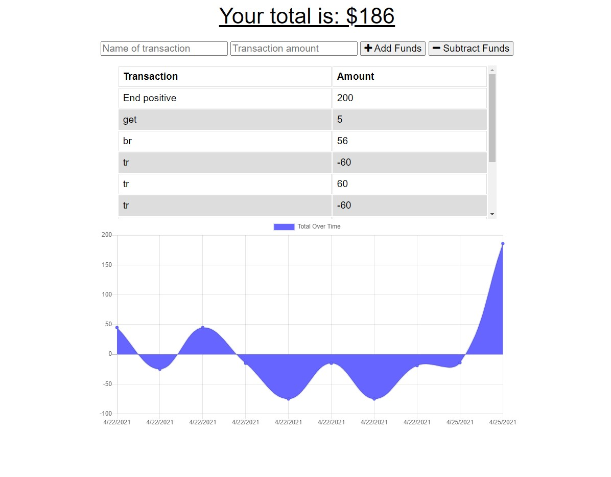

# 19. Progressive Web Applications (PWA) Challenge: Budget Tracker

## Descrpition 
This application is a budget tracking interface that allows users to add and subtract funds. The app is capable of functioning outside the web browser as it is a Progressive Web App. It saves user data locally and offline thanks to indexedDB. The data syncs with MongoDB when the user is online again. 

## Demo
Link to deployed application: https://grech17-budget-tracker.herokuapp.com/ 

## Installation
To manipulate my code, clone the repo to your machine, then in the root terminal type "npm i" to install dependencies. 
